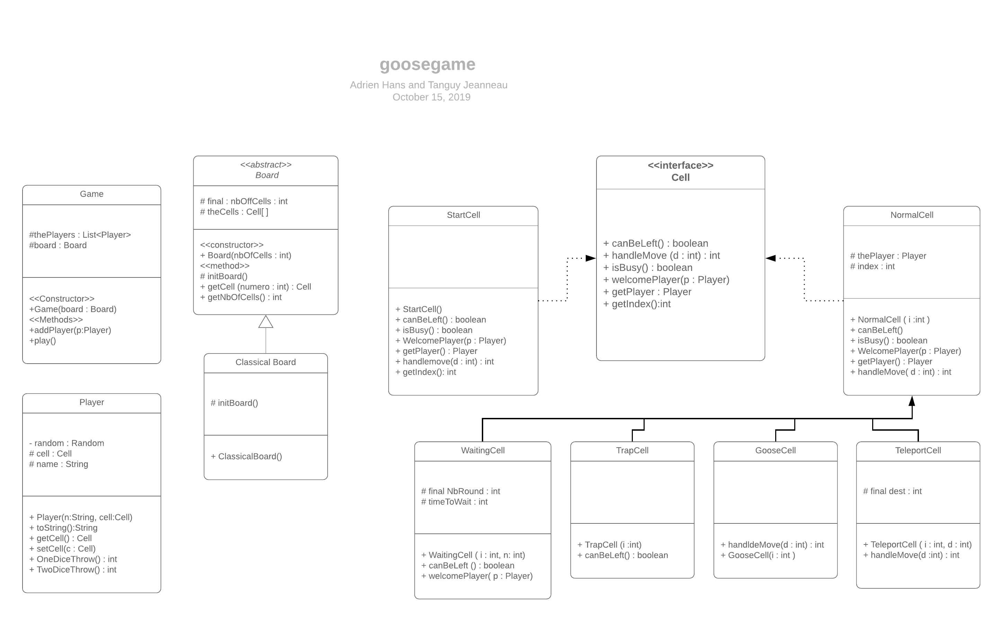

# Adrien HANS et Tanguy JEANNEAU
# Tp Jeu de l'oie : 

## Correction Q1 : 
Algorithme de la méthode play de la classe Game : 

TQ aucun joueur sur la case finale 
     &nbsp; joueur <- joueur suivant
     &nbsp; Si la cellule peut être quittée,alors  
    &nbsp; &nbsp; &nbsp; dé <- joueur joue
         &nbsp; &nbsp; &nbsp; arrivée <- trouve_la_cellule(dé, départ)
          &nbsp; &nbsp; &nbsp; Si arrivée est occupée, alors
            déplace l'occupant dans départ
 &nbsp; &nbsp; &nbsp; fin si
         &nbsp; &nbsp; &nbsp;Déplace joueur dans arrivée
     &nbsp; fin si 
 fin TQ 

## Q2 : 
Diagrammes UML dans le fichier `Java_UML_goosegame_HANS_JEANNEAU.png` ci-joint.

## Q3 : 
Code pour la classe abstraite dans le fichier `Board.java`
On propose un code pour une sous classe de board, `ClassicalBoard.java`, qui définit le plateau "classique" du jeu de l'oie. 

## Q4 : 
La case 0 est gérée par la sous-classe `StartCell` de la classe `Cell`. 
Elle définit les propriétés de la case 0, c'est-à-dire de la case départ, notamment en renvoyant toujours `True` pour canBeLeft() et ne renvoie rien pour WelcomePlayer(p : Player).

## Q5 : 
Le programme correspondant au jeu de l'oie et tel que décrit plus haut est joint à ce fichier. 
